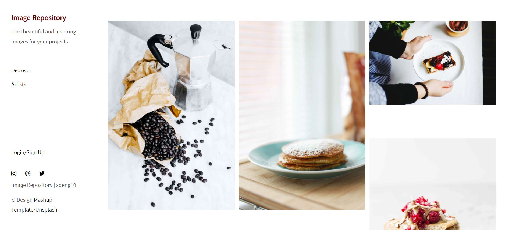
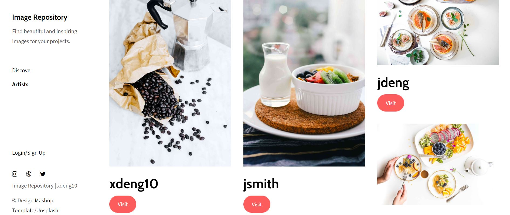
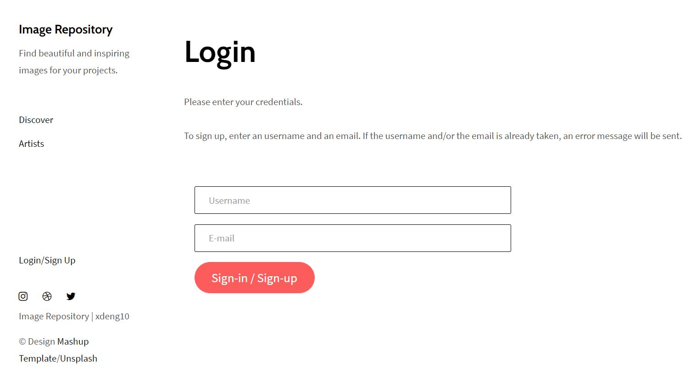
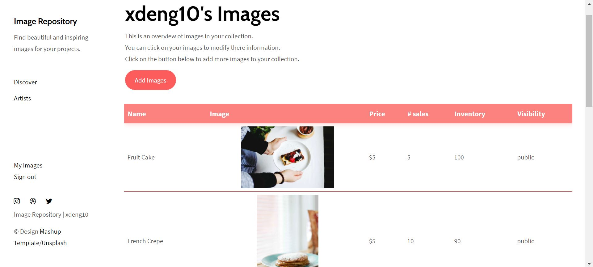
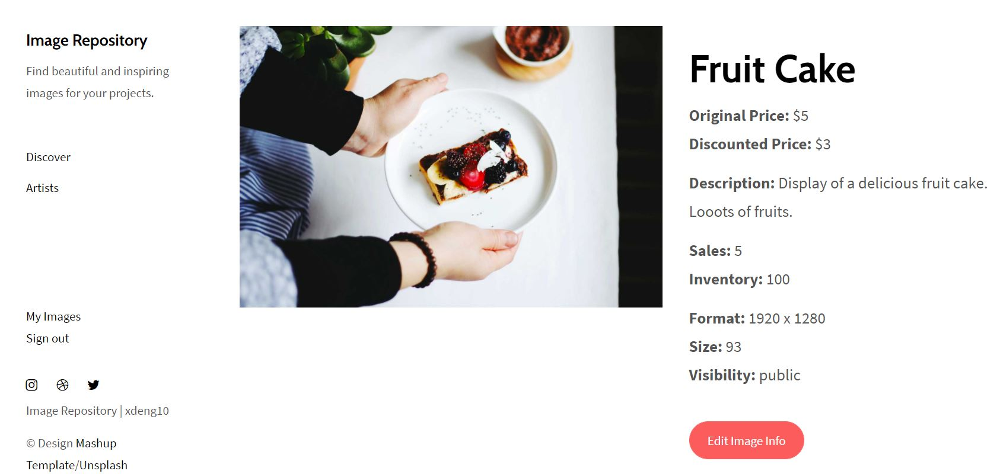

# Image-Repository 

Image repositroy is a platform to allow everyone to discover amazing arţwork and potentially purchasing some of them. 
Artists can create an account and add their arts to the website.

Shopify Challenge for backend development. 

### Link to the website
https://image-repository-shopify2021.herokuapp.com/

 
 
## Features
#### "Discovery" section: 
Displays all images where the visibility is set to "public". 
Click on any of the images to see more information about the artwork.

 

#### "Artists" section:
Displays all artists (with at least one image set to "public") on the platform.
Click on any artists to see their work.
i

 

#### Create your account:
Click on *Login/Sign up* in the side menu.
Enter any username and email combination. If the username and/or the email is already taken, please choose another one. 

If you just want to try out the website, you can use the following credentials:
* Username: xdeng10
* Email: xdeng10@image.repo

 

#### "My images":
After signing in, the "My images" link will appear on the side menu. It leads you to a list of all images/artwork associated with the user and some information about the art.
You can add new images the account by clicking the *Add Images* button. 

Click on any images in the list to edit that image's information. 
If you set an image's visibility to "private", that image will no longer appear on the public webpages ("Discover", "Artists", etc.).

 

## Warning
Images uploaded to the website through Heroku app platform could disappear after a while. Heroku uses a temporary filesystem and all written files is discarded after a new deployment or as part of Heroku's normal dyno management.

 
 

## Installation
You can download this repo to use it locally (Make sure to have a php environment already set up)
A MySQL database can be found in assets if you want to download this repo and run it on your computer.
 
 

## Credits
The design of the website is a template taken from "Mashup templates" and developped by "Orson.io" team. http://www.mashup-template.com/preview.html?template=savory

